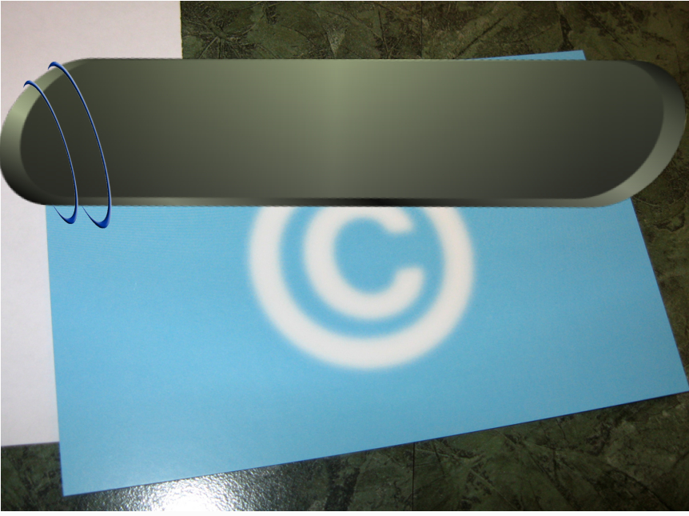

---

layout: bright

style: |

    #Cover h2 {
        margin:30px 0 0;
        color:#FFF;
        text-align:center;
        font-size:70px;
        }
    #Cover p {
        margin:10px 0 0;
        text-align:center;
        color:#FFF;
        font-style:italic;
        font-size:20px;
        }
        #Cover p a {
            color:#FFF;
            }
    #Picture h2 {
        color:#FFF;
        }
    #SeeMore h2 {
        font-size:100px
        }
    #SeeMore img {
        width:0.72em;
        height:0.72em;
        }
---

# Copyrights & Licenses Presentation {#Cover}

*Brought to you by [George ajam](http://geoiraq.github.io/) and generated by [Jekyller](https://github.com/shower/jekyller)*

<!-- (http://copyright.umich.edu). Created by the University's "Intellectual Property Specialist". -->

## Copyrights
Defined as the legal right created by the law of a country, that grants the creator/originator or an assignee the exclusive legal rights to (distribute, use, print, publish, perform, film or record) literary, artistic, or musical material, computer programs/codes and to give permission to others to do some or all of the rights above.[1]

## Copyrights
1. Things that can be copyrighted need to be in a fixed tangible medium of expression (paper/online), excluding any work previously copyrighted or in the public domain.
2. Original work or expression of idea is protected (not the idea itself) automatically in Australia [2], and centralized in USA by United State Copyrights Office [3].

## Duration of Copyright
 - Literacy, dramatic, musical and artistic works, lasts 70 years from the year of the author's death or from the year of first publication after the author's death.
 - Films and sound recordings lasts 70 years from their publication and for broadcasts, 70 years from the year in which they were made.
 - Copyrights may be extended to 20 years if expires.

## License
The license means **permission(s)** granted by *“licensor”* (creator/holder of license) to another party **“licensee”** as an element of an authorization agreement to use the copyrighted material (by the licensee). 

## Definitions [4]
- “anonymous work” : a work done by a non identified person/author.
- “pseudonymous work”: a work done by someone identified by a fictitious name.
- “collective work” is a work in which a number of contributions that contains separate and independent works in themselves, are assembled into a collective whole.

## Definitions [4] *cont'd*
- A “derivative work” is a work based upon one or more preexisting works, such as a translation, musical arrangement, dramatization, fictionalization, motion picture version, sound recording, art reproduction, abridgment, condensation, or any other form in which a work may be recast, transformed, or adapted. A work consisting of editorial revisions, annotations, elaborations, or other modifications which, as a whole, represent an original work of authorship, is a “derivative work”.

## Copyrights Options
Any document may fall in one of the below categories
 - Public domain. (free!)
 - “All Rights Reserved”. ©  
 - GNU Free Documentation License [FDL](http://www.gnu.org/copyleft/fdl.html), where all derivatives in from an FDL work must remain free.
 - Creative Commons Licenses.
{:.note}
A similar licenses to Creative commons are also exists to Databases [(Open Database License)](opendatacommons.org/licenses/odbl/) 

##Rights under Creative Common (CC) Licenses
1. *All Rights Reserved*.
  No distribution, copy, use, tweak, reuse, mix or build upon unless getting permission (license) from the copyrights holder.
2. *Creative Common Zero CC0*.
  No Rights Reserved.
3. *Creative Common Attribution*.
  lets others distribute, remix, tweak, and build upon your work, even commercially, as long as they credit the creator

##Rights under Creative Common (CC) Licenses. *Cont'd*
4. *Creative Common Attribution-NoDerivs*. 
allows for redistribution, commercial and non-commercial, as long as it is passed along unchanged and in whole, with credit to creator.
5. *Creative Common Attribution-NonCommercial-ShareAlike*.
lets others remix, tweak, and build upon your work non-commercially, as long as they credit you and license their new creations under the identical terms
6. *Creative Common Attribution-ShareAlike*.
 remix, tweak, and build upon the work even for commercial purposes, as long as the user credit creator and license their new creations under the identical terms.(copyleft)

##Rights under Creative Common (CC) Licenses. *Cont'd*
7. *Creative Common Attribution-NonCommercial*.
 This license lets others remix, tweak, and build upon your work non-commercially, and although their new works must also acknowledge you and be non-commercial, they don’t have to license their derivative works on the same terms.
8. *Creative Common Attribution-NonCommercial-NoDerivs*.
 This license is the most restrictive, only allowing others to download the work and share it with others as long as they credit you, but they can’t change them in any way or use them commercially.

## Tools to choose a license
- Creative Common help users pick a public license from this [tool](http://creativecommons.org/choose/).
- It offers a different public licenses formed in: 
  - Description of the License.
  - Logo of the license with link to the license which normally be in human readable format.

## Who uses CC
For publishing work under Creative Commons there are major communities such as:

Wikipedia, scribd, slidshare, Internet Archive,
Flickr, wordPress, Blogger, Vimeo, Youtube,
Wikimedia Commons, SoundCloud..

1. Built on HTML, CSS and vanilla JavaScript
2. All modern browsers are supported
3. Slide themes are separated from engine
4. Fully keyboard accessible
5. Printable to PDF

{:.note}
Shower ['ʃəuə] noun. A person or thing that shows.

## Plain Text on Your Slides

Lorem ipsum dolor sit amet, consectetur [adipisicing](#all-kind-of-lists) elit, sed do eiusmod tempor incididunt ut labore et dolore magna aliqua. Ut enim ad minim veniam, *quis nostrud* exercitation ullamco laboris **nisi ut aliquip** ex ea commodo consequat. Duis aute irure <i>dolor</i> in reprehenderit in voluptate velit esse cillum <b>dolore</b> eu fugiat nulla pariatur. Excepteur sint occaecat cupidatat non proident, sunt in `<culpa>` qui officia deserunt mollit anim id est laborum.

## All Kind of Lists

1. Simple lists are marked with bullets
2. Ordered lists begin with a number
3. You can even nest lists one inside another
    - Or mix their types
    - But do not go too far
    - Otherwise audience will be bored
4. Look, seven rows exactly!

## Serious Citations

<figure markdown="1">

> Lorem ipsum dolor sit amet, consectetur adipisicing elit, sed do eiusmod tempor incididunt ut labore et dolore magna aliqua. Ut enim ad minim veniam, quis nostrud exercitation ullamco laboris nisi ut aliquip ex ea commodo consequat. Duis aute irure dolor in reprehenderit in voluptate velit esse cillum dolore eu fugiat nulla pariatur. Excepteur sint occaecat cupidatat non proident, sunt in culpa qui officia.

<figcaption>Marcus Tullius Cicero</figcaption>
</figure>

## Code Samples

    <!DOCTYPE html>
    <html lang="en">
    <mark><head></mark> <mark class="comment"><!--Comment--></mark>
        <title>Shower</title>
        <meta charset="<mark class="important">UTF-8</mark>">
        <link rel="stylesheet" href="screen.css">
    <mark></head></mark>

## Even Tables

|  Locavore      | Umami       | Helvetica | Vegan     |
+----------------|-------------|-----------|-----------+
|* Fingerstache *| Kale        | Chips     | Keytar    |
|* Sriracha     *| Gluten-free | Ennui     | Keffiyeh  |
|* Thundercats  *| Jean        | Shorts    | Biodiesel |
|* Terry        *| Richardson  | Swag      | Blog      |

It’s good to have information organized.

## Pictures
{:.cover #Picture}

<!-- photo by John Carey, fiftyfootshadows.net -->

## **You can even shout this way**

## Inner Navigation

1. Lets you reveal list items one by one
2. …To keep some key points
3. …In secret from audience
4. …But it will work only once
5. …Nobody wants to see the same joke twice

##  [See more on GitHub](https://github.com/shower/shower/)
{:.shout #SeeMore}
