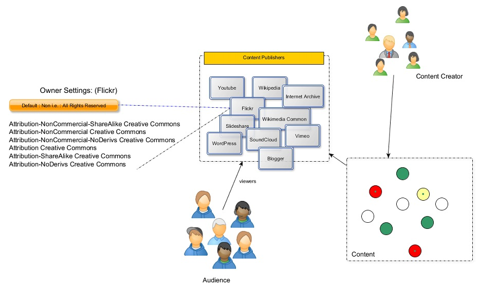

---

layout: default

style: |

    #Cover h2 {
        margin:30px 0 0;
        color:#FFF;
        text-align:center;
        font-size:70px;
        }
    #Cover p {
        margin:10px 0 0;
        text-align:center;
        color:#FFF;
        font-style:italic;
        font-size:20px;
        }
        #Cover p a {
            color:#FFF;
            }
    #Picture h2 {
        color:#FFF;
        }
    #SeeMore h2 {
        font-size:100px
        }
    #SeeMore img {
        width:0.72em;
        height:0.72em;
        }
---

# Copyrights & Licenses {#Cover}

*Brought to you by [George ajam](http://geoiraq.github.io/) and generated by [Jekyller](https://github.com/shower/jekyller)*

<!-- (http://copyright.umich.edu). Created by the University's "Intellectual Property Specialist". under CC-BY -->

## Copyrights
Defined as the legal right created by the law of a country, that grants the creator/originator or an assignee the exclusive legal rights to (distribute, use, print, publish, perform, film or record) literary, artistic, or musical material, computer programs/codes and to give permission to others to do some or all of the rights above.[1]

## Copyrights
1. Things that can be copyrighted need to be in a fixed tangible medium of expression (paper/online), excluding any work previously copyrighted or in the public domain.
2. Original work or expression of idea is protected (not the idea itself) automatically in Australia [2], and centralized in USA by United State Copyrights Office [3].

## Duration of Copyright
 - Literacy, dramatic, musical and artistic works, lasts 70 years from the year of the author's death or from the year of first publication after the author's death.
 - Films and sound recordings lasts 70 years from their publication and for broadcasts, 70 years from the year in which they were made.
 - Copyrights may be extended to 20 years if expires.

## License
The license means **permission(s)** granted by *“licensor”* (creator/holder of license) to another party **“licensee”** as an element of an authorization agreement to use the copyrighted material (by the licensee). 

## Definitions [4]
- “anonymous work” : a work done by a non identified person/author.
- “pseudonymous work”: a work done by someone identified by a fictitious name.
- “collective work” is a work in which a number of contributions that contains separate and independent works in themselves, are assembled into a collective whole.

## Definitions [4] *cont'd*
- A “derivative work” is a work based upon one or more preexisting works, such as a translation, musical arrangement, dramatization, fictionalization, motion picture version, sound recording, art reproduction, abridgment, condensation, or any other form in which a work may be recast, transformed, or adapted. A work consisting of editorial revisions, annotations, elaborations, or other modifications which, as a whole, represent an original work of authorship, is a “derivative work”.

## Copyrights Options
Any document may fall in one of the below categories:

- Public domain. (free!)
- “All Rights Reserved”. ©  
- GNU Free Documentation License [FDL](http://www.gnu.org/copyleft/fdl.html).
- Creative Commons Licenses.

A similar licenses to Creative commons to Databases on [(Open Database License)](opendatacommons.org/licenses/odbl/) 

##Rights under Creative Common (CC) Licenses
1- *All Rights Reserved*.
  No distribution, copy, use, tweak, reuse, mix or build upon unless getting permission (license) from the copyrights holder.

2- *Creative Common Zero CC0*.
  No Rights Reserved.

##Rights under Creative Common (CC) Licenses. *Cont'd*
3- *Creative Common Attribution*.
  lets others distribute, remix, tweak, and build upon your work, even commercially, as long as they credit the creator.

4- *Creative Common Attribution-NoDerivs*. 
allows for redistribution, commercial and non-commercial, as long as it is passed along unchanged and in whole, with credit to creator.

##Rights under Creative Common (CC) Licenses. *Cont'd*
5- *Creative Common Attribution-NonCommercial-ShareAlike*.
lets others remix, tweak, and build upon your work non-commercially, as long as they credit you and license their new creations under the identical terms
6- *Creative Common Attribution-ShareAlike*.
 remix, tweak, and build upon the work even for commercial purposes, as long as the user credit creator and license their new creations under the identical terms.(copyleft)

##Rights under Creative Common (CC) Licenses. *Cont'd*
7- *Creative Common Attribution-NonCommercial*.
 This license lets others remix, tweak, and build upon your work non-commercially, and although their new works must also acknowledge you and be non-commercial, they don’t have to license their derivative works on the same terms.

8- *Creative Common Attribution-NonCommercial-NoDerivs*.
 This license is the most restrictive, only allowing others to download the work and share it with others as long as they credit you, but they can’t change them in any way or use them commercially.

## Tools to choose a license
- Creative Common help users pick a public license from this [tool](http://creativecommons.org/choose/).
- It offers a different public licenses formed in: 
  - Description of the License.
  - Logo of the license with link to the license which normally be in human readable format.

## Who uses CC
For publishing work under Creative Commons there are major communities such as:

Wikipedia, scribd, slidshare, Internet Archive,
Flickr, wordPress, Blogger, Vimeo, Youtube,
Wikimedia Commons, SoundCloud..

## Settings of CC
{:.cover #Picture}

<!-- photo by George Ajam -->

## Linking & Framing and Streaming Issues.
- Inline linking to materlias is not an infirngment of the copyrights but for images there are issues.
- Streaming a broadcaste or a video in a frame within a webpage without license includes liabilities.
- P2P concept of linking considered as a copyright infringment.
{:.note} 
Need more readings..

## Copyrights Framework Analysis [Duke Uni. MOOC/Copyrights. 2014]
There are five questions for copyright analysis which are:
1. Is the work protected by copyright?
2. Is there a specific exception in copyright law that covers my use?
3. Is there a license that covers my use?
4. Is my use covered by fair use?
5. Do I need permission from the copyright owner for my use?

## Fair Use [Duke Uni. MOOC/Copyrights. 2014]
There are Four factors:
1. The purpose and character of the use, including whether such use is of a commercial nature or is for nonprofit educational purposes;
2. The nature of the copyrighted work; 
3. The amount and substantiality of the portion used in relation to the copyrighted work as a whole; and
4. The effect of the use upon the potential market for or value of the copyrighted work.

## The Basics of Getting Permission
There are five steps procedure:
1. Determine if permission is needed.
2. Identify the owner.
3. Identify the rights needed.
4. Contact the owner and negotiate whether payment is required.
5. Get your permission agreement in writing.
- See [more at:](http://fairuse.stanford.edu/overview/introduction/getting-permission/)

## The librarian way of maintaining permissions
For clearance they use a sheet with following headings 
| Course         | Material            | Holder      | Date       | Req. Response     | Fee | FollowUp  | Notes |
+----------------|---------------------|-------------|------------|---------------------|------------------------+
|* Duke Uni MOOC *| Copyrights for Edu | Some author | 05-09-2014 |agreed to 2 chapters | 10$ |         |ch 1&2 |

## License Mismatch Problems
In order to understand possible conflicts we need to answer the following questions:
1- What is the license that needed for the output of the work.
2- What components are included in the work.
3- Are there people involved in creating part of the work? What licenses they give?
4- Are there components which may have no information about it’s copyrights/licenses ?

## Compatibility Issues
The creative common licenses that encourage the free culture are
        CC Zero, CC BY, CC BY-SA
They Share this concept: 
If they are used for an output work all the partial work, images, videos ..etc in it require a similar license or greater than it in term of rights

## A Possible conflict
Slides with “All Rights Reserved ” at front page then in the content such as an image or code its licensed under one of the creative common license CC BY-NC-SA: CC Attribution-Non-Commercial-ShareAlike 
First conflict with the first Slide copyright since this kind of licenses means share alike the part you used so it remain in the same license attributes.
“All Rights reserved” is typically equal to the copyright act law which is preserving all rights to the author.
The (CC BY-NC-SA) license condition is that the whole collective work need to be licensed in non-commercial and share alike license. 

##  [Thanks](https://github.com/shower/shower/)
{:.shout #SeeMore}
